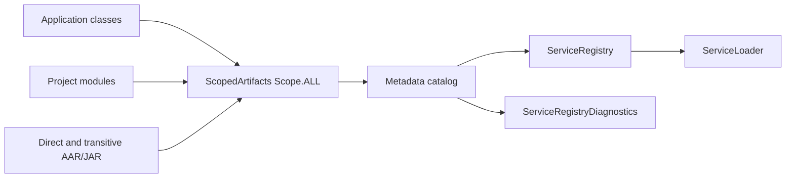

# auto-service-android

`auto-service-android` 是 Android 编译期服务注册框架。实现类用 `@AutoService` 声明，Gradle 插件在应用构建时生成显式注册表；运行时不扫描 classpath，也不通过反射查找实现。

当前版本为 `0.0.13`，支持基线为 **AGP 8.13.0 / Gradle 8.13 / JDK 17 / Kotlin 2.1.0**。插件只应用于 Android Application 模块；Android Library、Java/Kotlin 模块和外部 AAR/JAR 可以声明实现，但不应用插件。

## 能力与发现范围

- 扫描 Application 自身、所有项目模块、直接依赖和传递依赖中的 AAR/JAR class。
- 同一接口按 `priority` 升序、实现类全限定名升序稳定返回。
- 支持 alias 筛选、线程安全惰性单例、多接口共享同一个单例实例。
- 支持 `require()` 编译期必选实现检查，以及类名/alias 正则排除。
- `debuggable=true` 变体生成完整诊断，其他变体只保留不含候选元数据的空诊断入口。
- 变换任务可缓存、输出可复现；相同输入产生相同 JAR。
- 除生成注册表的保留类外，两个来源包含同名普通类会直接构建失败，并报告两个来源。



## 快速开始

### 1. 配置插件和依赖

私有仓库凭据只能通过环境变量或用户级 Gradle 属性提供，不要写入项目文件。四个组件必须使用同一版本。

```groovy
// 根 build.gradle
buildscript {
    repositories {
        google()
        mavenCentral()
        if (System.getenv('ALIYUN_USERNAME') && System.getenv('ALIYUN_PASSWORD')) {
            maven {
                url = uri('https://packages.aliyun.com/maven/repository/2202395-release-jr0puW/')
                credentials {
                    username = System.getenv('ALIYUN_USERNAME')
                    password = System.getenv('ALIYUN_PASSWORD')
                }
            }
        }
    }
    dependencies {
        classpath 'com.anymore:auto-service-register:0.0.13'
    }
}
```

只在 Application 模块应用插件：

```groovy
plugins {
    id 'com.android.application'
    id 'auto-service'
}

dependencies {
    implementation 'com.anymore:auto-service-loader:0.0.13'
}
```

Library 模块只依赖 loader 或 annotation 并声明实现：

```groovy
plugins { id 'com.android.library' }

dependencies {
    implementation 'com.anymore:auto-service-loader:0.0.13'
    // 仅编译注解时也可使用：compileOnly 'com.anymore:auto-service-annotation:0.0.13'
}
```

### 2. 声明并加载服务

```kotlin
interface StartupTask {
    fun run()
}

@AutoService(StartupTask::class, priority = -10, singleton = true)
class DatabaseStartupTask : StartupTask {
    override fun run() = Unit
}

@AutoService(StartupTask::class, priority = 10, alias = "debug")
class DebugStartupTask : StartupTask {
    override fun run() = Unit
}

ServiceLoader.load<StartupTask>().forEach { it.run() }
val debugTasks = ServiceLoader.load<StartupTask>("debug")
val required = ServiceLoader.load<StartupTask>().requireFirstPriority()
```

`@AutoService` 在 `0.0.13` 中仍使用 `AnnotationRetention.RUNTIME`。一个实现可以声明多个服务接口：

```kotlin
@AutoService(Runnable::class, java.util.concurrent.Callable::class, singleton = true)
class SharedService : Runnable, java.util.concurrent.Callable<Int> {
    override fun run() = Unit
    override fun call() = 1
}
```

## 诊断 API

```kotlin
val report = ServiceLoader.diagnose<StartupTask>("debug")

when (report.availability) {
    ServiceDiagnosticAvailability.AVAILABLE -> {
        println("注册数=${report.registeredCount}")
        println("alias 匹配数=${report.matchingCount}")
        report.entries.forEach(::println)
    }
    ServiceDiagnosticAvailability.UNAVAILABLE_IN_NON_DEBUG_BUILD ->
        println("当前变体未携带候选诊断元数据")
    ServiceDiagnosticAvailability.UNAVAILABLE_PLUGIN_NOT_APPLIED ->
        println("应用模块未应用或未执行 auto-service 插件")
}
```

Java 可调用 `ServiceLoader.diagnose(StartupTask.class, "debug")`。报告字段如下：

| 字段 | 含义 |
| --- | --- |
| `serviceClassName` / `requestedAlias` | 查询的接口和 alias。 |
| `availability` | 诊断可用状态。 |
| `entries` | 候选实现；状态为 `REGISTERED` 或 `EXCLUDED`。 |
| `registeredCount` / `matchingCount` | 已注册总数和当前 alias 匹配数。 |
| `availableAliases` | 已注册候选的稳定 alias 集合。 |

完整 entries 仅存在于 `debuggable=true` 变体。Release 等非 debuggable 变体仍能正常 `load()`，但 `diagnose()` 返回 `UNAVAILABLE_IN_NON_DEBUG_BUILD` 和空 entries，生成的诊断类不包含实现类名、alias 或排除正则。

## Gradle DSL

```groovy
autoService {
    checkImplementation = true
    sourceCompatibility = '1.8'
    logLevel = 'INFO' // VERBOSE、DEBUG、INFO、WARN、ERROR

    require(Runnable.class.name)
    require(Runnable.class.name, 'production')

    excludeClassName('com\\.example\\.legacy\\..*')
    excludeAlias('debug-.*')
    exclude('com\\.example\\.optional\\..*', 'experimental')
}
```

| 配置 | 默认值 | 行为 |
| --- | --- | --- |
| `checkImplementation` | `false` | 开启后验证所有 `require()`。 |
| `sourceCompatibility` | `"1.8"` | 生成注册表的 Java 编译版本。 |
| `logLevel` | `INFO` | 插件构建日志级别。 |
| `require(service[, alias])` | 无 | 要求扫描结果至少有一个匹配实现。 |
| `excludeClassName(pattern)` | 无 | 按实现类全限定名正则排除。 |
| `excludeAlias(pattern)` | 无 | 按 alias 正则排除。 |
| `exclude(classPattern, aliasPattern)` | 无 | 两个正则同时匹配时排除。 |

## 排序、实例与冲突规则

- `priority` 越小越先返回；相同 priority 按实现类全限定名排序。
- `singleton=false` 的实现每次遍历供应器时创建；`singleton=true` 使用双重检查锁定惰性缓存。
- 同一个 singleton 实现注册多个接口时，各接口复用同一个供应器和实例。
- `ServiceRegistry`、`ServiceRegistryDiagnostics` 及其生成内部类是插件可替换的保留类。
- 其他同名 class 来自不同输入时构建失败。不要依赖 classpath 顺序覆盖重复类。

## 模块

| 模块 | 职责 |
| --- | --- |
| `auto-service-annotation` | 定义 RUNTIME `@AutoService`。 |
| `auto-service-registry` | 诊断 DTO 及编译期注册表存根。 |
| `auto-service-loader` | `ServiceLoader` 和实例供应器；API 依赖 annotation 与 registry。 |
| `auto-service-plugin` | AGP Scoped Artifacts 全范围扫描、校验和确定性代码生成。 |
| `app` | 本仓库演示与真实 APK 验收。 |

## 构建与发布

```bash
./gradlew :auto-service-annotation:test :auto-service-registry:test :auto-service-loader:test
./gradlew :auto-service-plugin:test
./gradlew :app:assembleDebug :app:assembleRelease
```

发布前设置 `ALIYUN_USERNAME` 与 `ALIYUN_PASSWORD`。缺失时普通构建不配置私有解析仓库，`publish` 会在网络请求前以中文错误失败。历史中暴露过的凭据必须先由仓库所有者轮换。

```bash
./gradlew :auto-service-annotation:publish
./gradlew :auto-service-registry:publish
./gradlew :auto-service-loader:publish
./gradlew :auto-service-plugin:publish
```

## 文档

- [故障排查](docs/troubleshooting.md)：空结果、alias、排除、重复类、版本、Release 诊断和发布凭据。
- [进阶指南](docs/advanced-guide.md)：priority、多接口单例、require、全范围依赖发现和构建缓存。
- [变更日志](CHANGELOG.md)：版本升级与迁移说明。
- [开发说明](CLAUDE.md)：仓库结构、本地开发和发布级验收。

## 致谢

- [service-loader-android](https://github.com/johnsonlee/service-loader-android)
- [Google AutoService](https://github.com/google/auto/tree/master/service)
