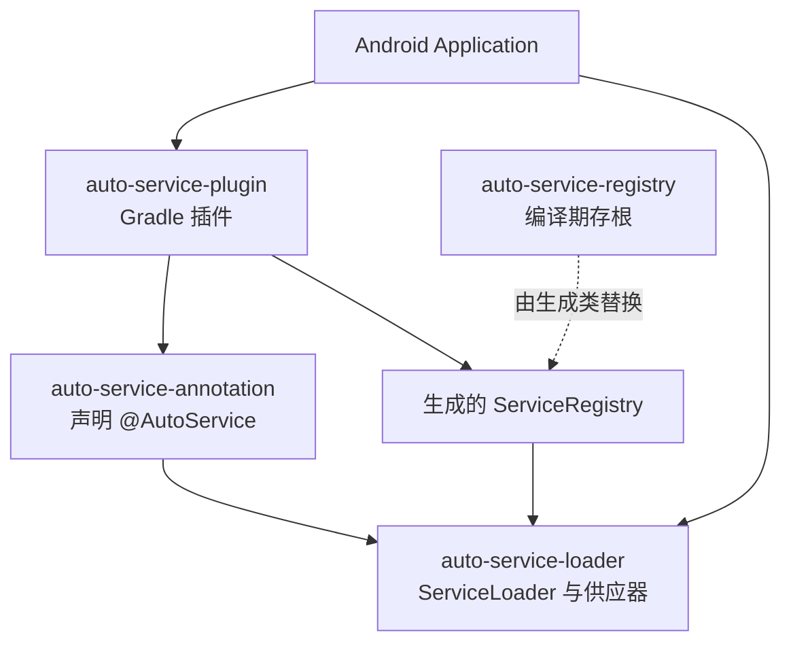

# auto-service-android

一个面向 Android 应用的编译期服务注册框架。它的使用方式接近 [Google AutoService](https://github.com/google/auto/tree/master/service)，但服务实现由 Gradle 插件在编译期汇总为 `ServiceRegistry`，运行时不需要扫描类路径或反射。

它适合把同一业务接口的多个实现解耦到不同模块或依赖中，例如启动任务、能力适配器和可选功能组件。框架提供优先级、别名、线程安全的惰性单例、编译期必选实现检查，以及对三方实现的排除规则。

当前仓库版本为 `0.0.12`。仓库的构建基线为 AGP `8.13.0`、Gradle `8.13`、Kotlin `2.1.0`；使用新版本插件前请在自己的 Debug 和 Release 变体上完成构建验证。

## 特性

- **无反射加载**：构建时生成注册表，运行时只查询 `Map<Class<*>, List<...>>`。
- **稳定排序**：同一接口的实现按 `priority` 从小到大返回；优先级相同时按类名字典序排序。
- **按别名筛选**：可为同一接口注册不同场景的实现，并在加载时指定别名。
- **惰性单例**：`singleton = true` 的实现采用 `volatile` 与双重检查锁定，首次访问时创建且线程安全。
- **编译期预检查**：可要求指定接口或“接口 + 别名”必须存在实现，避免运行时才发现服务缺失。
- **排除规则**：可通过类名、别名的正则表达式排除来自依赖 AAR/JAR 的实现。

## 工作原理

```mermaid
flowchart LR
    I[实现类\n@AutoService] --> C[Java / Kotlin 编译产物]
    D[依赖中的 class 与 jar] --> S
    C --> S[auto-service Gradle 插件扫描字节码]
    S --> G[JavaPoet 生成\nServiceRegistry.java]
    G --> P[编译并打包进 APK / AAB]
    P --> L[ServiceLoader.load<T>()]
    L --> R[按优先级和别名\n返回服务实例]
```

构建阶段，插件读取应用变体及其依赖中的 `.class` / `.jar`，用 Javassist 解析 `@AutoService` 注解，按服务接口分组并生成 `com.anymore.auto.ServiceRegistry`。这个生成类会替换运行时库中的同名存根，成为应用最终包内的服务索引。

运行阶段，`ServiceLoader` 通过该索引获取供应器列表：非单例实现按需创建；标记为单例的实现首次访问后会被缓存。

## 快速开始

以下示例以 Groovy DSL 和 Android Application 模块为例。插件只面向应用模块，请不要将 `auto-service` 应用于 Android Library 模块。

### 1. 配置仓库与构建插件

在项目根目录的 `build.gradle` 中配置仓库。凭据请通过环境变量或 CI 密钥注入，**不要把真实账号密码写进版本库**。

```groovy
buildscript {
    repositories {
        google()
        mavenCentral()
        maven {
            url = uri("https://packages.aliyun.com/maven/repository/2202395-release-jr0puW/")
            credentials {
                username = System.getenv("ALIYUN_USERNAME")
                password = System.getenv("ALIYUN_PASSWORD")
            }
        }
    }

    dependencies {
        classpath("com.anymore:auto-service-register:0.0.12")
    }
}
```

项目中使用该私有仓库的模块也需要在其依赖仓库配置中加入相同的 Maven 地址与凭据。

### 2. 应用插件并添加运行时依赖

在 Application 模块的 `build.gradle` 中：

```groovy
plugins {
    id 'com.android.application'
    id 'kotlin-android'       // 如果模块使用 Kotlin
    id 'auto-service'
}

dependencies {
    api("com.anymore:auto-service-loader:0.0.12")
}
```

`auto-service-loader` 会传递提供 `@AutoService` 注解；如需显式依赖，也可单独引入 `com.anymore:auto-service-annotation:0.0.11`。

### 3. 标记服务实现

```kotlin
import com.anymore.auto.AutoService

interface StartupTask {
    fun run()
}

@AutoService(StartupTask::class, priority = -10, singleton = true)
class DatabaseStartupTask : StartupTask {
    override fun run() = Unit
}

@AutoService(StartupTask::class, priority = 10, alias = "debug")
class DebugStartupTask : StartupTask {
    override fun run() = Unit
}
```

一个实现类可注册到多个接口：

```kotlin
@AutoService(Runnable::class, java.util.concurrent.Callable::class, singleton = true)
class SharedService : Runnable, java.util.concurrent.Callable<Int> {
    override fun run() = Unit
    override fun call() = 1
}
```

### 4. 加载服务

```kotlin
import com.anymore.auto.ServiceLoader

// 返回全部 StartupTask，实现顺序为 priority 从小到大。
ServiceLoader.load<StartupTask>().forEach { it.run() }

// 只返回 alias 为 debug 的实现。
val debugTasks = ServiceLoader.load<StartupTask>("debug")

// 取得最优先实现；没有实现时返回 null。
val first = ServiceLoader.load<StartupTask>().firstPriority

// 取得最优先实现；没有实现时抛出 IllegalArgumentException。
val required = ServiceLoader.load<StartupTask>().requireFirstPriority()
```

## 注解与运行时 API

### `@AutoService`

| 参数 | 类型 | 默认值 | 说明 |
| --- | --- | --- | --- |
| `value` | `KClass<*>` 可变参数 | 必填 | 要注册的一个或多个服务接口。 |
| `priority` | `Int` | `0` | 越小越优先；相同优先级按实现类名排序。 |
| `alias` | `String` | `""` | 服务别名。加载时传入别名可筛选实现。 |
| `singleton` | `Boolean` | `false` | 是否以线程安全的惰性单例方式创建。 |

### `ServiceLoader<T>`

| 成员 | 说明 |
| --- | --- |
| `ServiceLoader.load<T>(alias)` | Kotlin 泛型入口，返回可迭代的服务加载器。 |
| `ServiceLoader.load(clazz, alias)` | Java / 非泛型调用入口。 |
| `firstPriority` / `lastPriority` | 返回优先级最高 / 最低的实现；没有实现时返回 `null`。 |
| `requireFirstPriority()` / `requireLastPriority()` | 与上面对应，但没有实现时抛出异常。 |
| `iterator()` | 依次返回服务实例。服务实例在遍历到对应元素时才创建。 |

> `singleton = false` 不意味着每次 `load()` 都立即创建新对象。实例是在遍历到该项时创建；重新遍历或重新加载时会再次创建。`singleton = true` 的实例会在生成注册表的供应器中缓存。

## Gradle 配置参考

在 Application 模块中通过 `autoService {}` 配置插件：

```groovy
autoService {
    // 默认 false。仅当需要启用 require() 的编译期检查时设为 true。
    checkImplementation = true

    // 生成的 ServiceRegistry.java 的 Java 源 / 目标版本；默认 "1.7"。
    // 建议与 Android 模块的 compileOptions 保持一致。
    sourceCompatibility = "1.8"

    // 可选：VERBOSE、DEBUG、INFO、WARN、ERROR；默认 INFO。
    logLevel = "INFO"

    // 要求至少有一个 Runnable 实现。
    require(Runnable.class.name)

    // 要求 Runnable 至少有一个 alias 为 "production" 的实现。
    require(Runnable.class.name, "production")

    // 以下规则都支持正则表达式。
    excludeAlias("debug-.*")
    excludeClassName("com\\.example\\.legacy\\..*")
    exclude("com\\.example\\.optional\\..*", "experimental")
}
```

### 预检查行为

当 `checkImplementation = true` 时，插件会检查所有 `require()` 条目：

- `require("a.b.Service")` 要求存在至少一个对应实现；
- `require("a.b.Service", "china")` 要求存在该接口且别名为 `china` 的实现；
- 检查失败会让构建失败，并列出缺失的接口或别名。

这项检查适合搭配 `requireFirstPriority()` 使用：前者把服务缺失提前到构建期，后者在代码意外绕过预检查时提供运行时保护。

### 排除规则行为

插件在扫描期将实现的全限定类名和 `alias` 与规则匹配。匹配时该实现不会写入 `ServiceRegistry`。这可避免第三方依赖中的默认实现被应用意外加载。

| 方法 | 匹配字段 | 示例 |
| --- | --- | --- |
| `excludeClassName(pattern)` | 类全限定名 | `excludeClassName("com\\.example\\..*")` |
| `excludeAlias(pattern)` | 别名 | `excludeAlias("debug-.*")` |
| `exclude(classPattern, aliasPattern)` | 两者同时匹配 | `exclude("com\\.example\\..*", "beta")` |

## 模块与职责



| 模块 | 职责 | 主要内容 |
| --- | --- | --- |
| `auto-service-annotation` | 注解 API | 定义 `@AutoService` 及其参数。 |
| `auto-service-loader` | 运行时 API | 定义 `ServiceLoader`、供应器和惰性单例逻辑。 |
| `auto-service-plugin` | 编译期代码生成 | 扫描字节码、执行预检查、按规则筛选并生成注册表。 |
| `auto-service-registry` | 编译期存根 | 提供 `ServiceRegistry` 类型以便 loader 编译；最终由生成代码替换。 |
| `app` | 演示应用 | 展示多个接口、单例、优先级与并发访问。 |

## 构建与验证

### 环境要求

| 工具 | 仓库基线 |
| --- | --- |
| JDK | 11 或更高版本（AGP 8 构建建议使用 JDK 17） |
| Gradle Wrapper | 8.13 |
| Android Gradle Plugin | 8.13.0 |
| Kotlin | 2.1.0 |
| 示例应用 | `compileSdk 33`、`minSdk 17` |

常用命令：

```bash
# 构建示例应用
./gradlew :app:assembleDebug
./gradlew :app:assembleRelease

# 运行示例应用的本地单元测试
./gradlew :app:testDebugUnitTest

# 运行 Gradle 插件的功能测试
./gradlew :auto-service-plugin:test
```

开发 `auto-service-plugin` 时，根项目默认消费已发布的插件坐标。若需让 `app` 直接加载本地插件源码，可按照 [CLAUDE.md](./CLAUDE.md) 的 buildSrc 开发模式切换；完成后恢复模块模式并发布新的插件版本，示例应用才能消费该版本。

## 发布

项目使用 `maven-publish`。发布前在环境中提供 `ALIYUN_USERNAME` 和 `ALIYUN_PASSWORD`，不要将凭据提交到仓库：

```bash
./gradlew :auto-service-annotation:publish
./gradlew :auto-service-loader:publish
./gradlew :auto-service-registry:publish
./gradlew :auto-service-plugin:publish
```

项目保留 `uploadArchives` 兼容任务，它会委托到对应的 `publish` 流程。发布版本来自 `gradle.properties` 的 `VERSION`；使用方应以仓库中已发布的坐标为准，插件使用坐标见上方的快速开始。

## 常见问题

### `ServiceLoader` 找不到实现

确认以下事项：

1. 实现类已使用 `@AutoService` 标记，且 `value` 中包含目标接口；
2. 应用模块应用了 `id 'auto-service'`，而不仅是依赖了 loader；
3. 实现类在当前应用变体或其依赖的编译产物中；
4. 没有被 `exclude*` 规则排除；
5. 若使用别名，`load<T>(alias)` 的字符串与注解中的 `alias` 完全一致。

### 构建时报缺少 required service

这是 `checkImplementation = true` 与 `require()` 的预检查结果。新增对应接口实现、修正别名，或在不需要检查的变体中移除该 `require()` 配置即可。

### 单例在不同接口下的行为

一个类可以注册多个接口。`singleton = true` 时，生成注册表会复用同一供应器，确保通过不同接口访问该实现时仍为同一个实例。

### 为什么没有使用 Java 的 `ServiceLoader`

Java `ServiceLoader` 依赖 `META-INF/services` 资源并在运行时扫描。该项目改为生成显式注册代码，避免 Android 端的资源扫描和反射式加载路径，同时保留接近集合遍历的调用体验。

## 变更记录与维护

- 版本历史见 [CHANGELOG.md](./CHANGELOG.md)。
- AGP 8 适配的设计与验收记录见 [docs/superpowers/specs/2026-08-01-agp8-complete-adaptation-design.md](./docs/superpowers/specs/2026-08-01-agp8-complete-adaptation-design.md)。
- 提交代码前请执行与改动范围相符的 Debug、Release 与插件功能测试。

## 致谢

- [service-loader-android](https://github.com/johnsonlee/service-loader-android)
- [Google AutoService](https://github.com/google/auto/tree/master/service)
