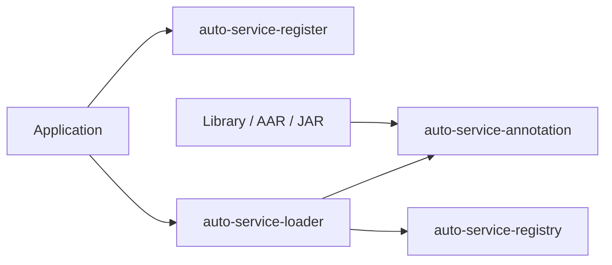
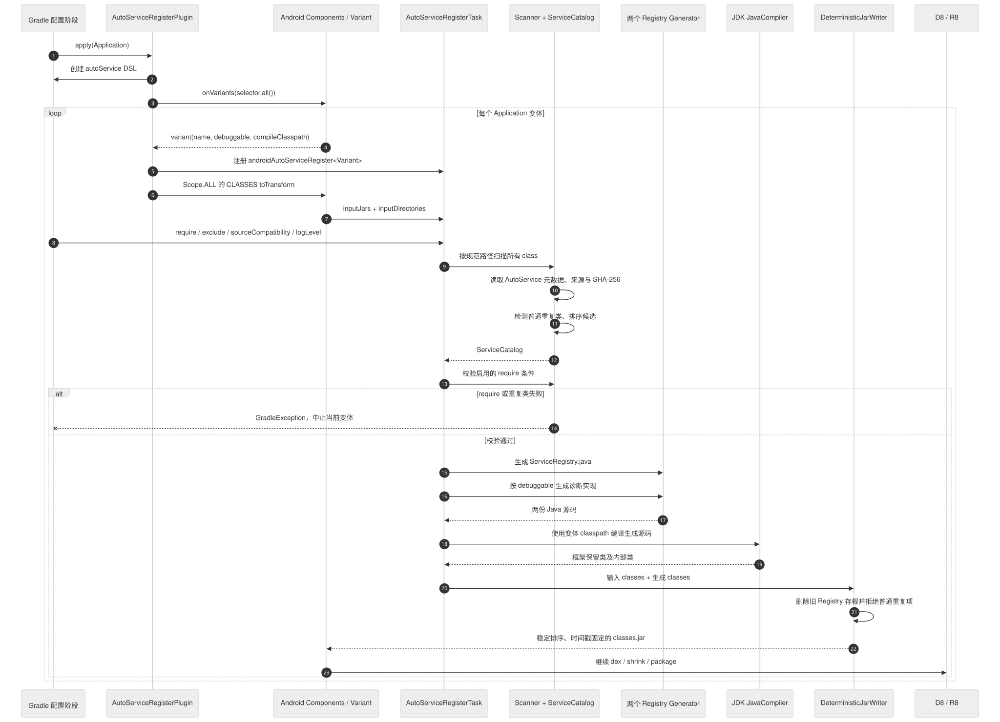
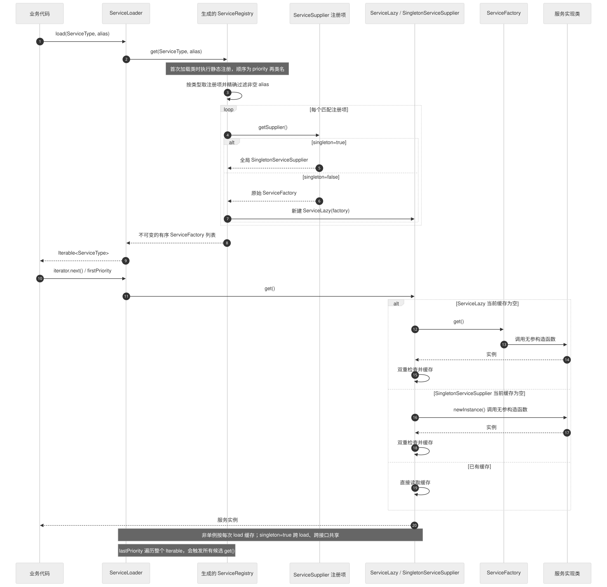
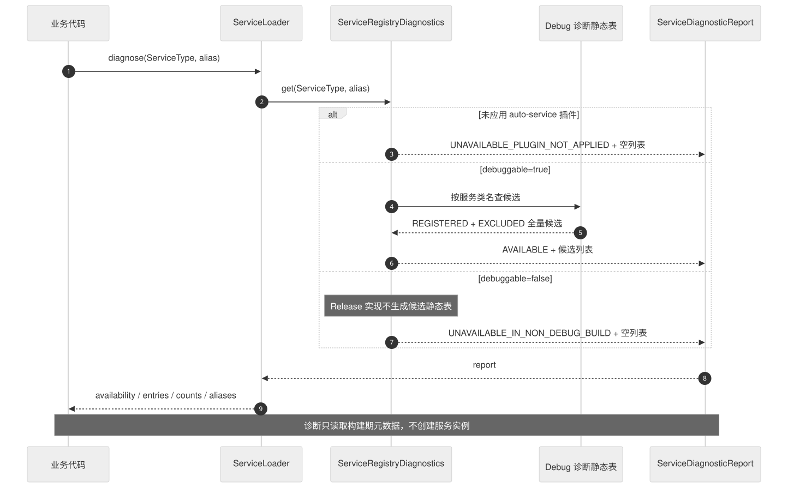

# auto-service-android 架构与类关系

这个库把“运行时扫描实现类”改成“构建时扫描 class、生成直接引用”。应用启动时只查内存中的注册表，不遍历 dex，也不反射查找实现。

## 模块边界

| 模块 | 产物职责 | 主要依赖方 |
| --- | --- | --- |
| `auto-service-annotation` | 定义 `@AutoService` 元数据。 | 声明实现的所有模块。 |
| `auto-service-registry` | 提供诊断 DTO 和两个可替换存根。 | loader、生成代码。 |
| `auto-service-loader` | 提供业务侧 `load()`、`diagnose()` 和实例包装。 | Application 与 Library。 |
| `auto-service-plugin` | 扫描完整变体 class、校验、生成、合并。 | 只应用于 Application。 |
| `app` | 演示多接口单例与运行时加载。 | 仓库验收。 |

发布后的依赖方向是：



Library 模块不应用插件。所有聚合只在最终 Application 变体执行，因此每个 APK 只有一份注册表。

## 编译期流程

1. `AutoServiceRegisterPlugin` 等待 `com.android.application`，创建 `autoService` 扩展。
2. 插件为每个变体注册 `AutoServiceRegisterTask`，并接到 `ScopedArtifacts.Scope.ALL` 的 class 变换链。
3. `ClassMetadataScanner` 直接解析目录和 JAR 中的 class 元数据，不加载用户类。
4. `ServiceCatalog` 记录 class 来源和服务候选，按 priority、类名建立稳定顺序。
5. `RequiredServiceValidator` 检查启用的 `require()`。
6. 两个生成器分别写出 `ServiceRegistry.java` 与 `ServiceRegistryDiagnostics.java`。
7. JDK 编译器编译生成源码，`DeterministicJarWriter` 合并全部 class 并替换两个保留存根。



源文件：[Mermaid](../diagrams/plugin-build-pipeline.mmd) · [Excalidraw](../diagrams/plugin-build-pipeline.excalidraw) · [PNG](../diagrams/plugin-build-pipeline.png)



时序图：[Mermaid](../diagrams/auto-service-build-sequence.mmd) · [PNG](../diagrams/auto-service-build-sequence.png)

### 编译期类职责

| 类 | 直接职责 |
| --- | --- |
| `AutoServiceRegisterPlugin` | 校验插件应用位置、创建 DSL、连接 AGP typed API。 |
| `AutoServiceExtension` | 保存 require、exclude、源码兼容级别和日志级别。 |
| `AutoServiceRegisterTask` | 声明缓存输入输出，调用扫描/生成并编译生成源码。 |
| `AutoServiceRegisterAction` | 按“扫描 → 校验 → 生成”顺序编排纯逻辑。 |
| `ClassMetadataScanner` | 读取 visible/invisible class 注解和 class SHA-256。 |
| `ClassOrigin` | 保存类名、容器、entry 和内容摘要。 |
| `ServiceCandidate` | 保存服务、实现、priority、alias、singleton 和排除状态。 |
| `ServiceCandidateStatus` | 区分 `REGISTERED` 与 `EXCLUDED`。 |
| `ServiceCatalog` | 统一查询、排序、统计并检测重复 class。 |
| `ExclusiveRule` | 保存 className/alias 两个完整匹配正则。 |
| `RequiredServiceValidator` | 把缺失、全部排除、alias 不匹配转成可行动错误。 |
| `ServiceRegistryGenerator` | 生成加载注册表与实例供应器。 |
| `ServiceRegistryDiagnosticsGenerator` | 按 `variant.debuggable` 生成完整或最小诊断表。 |
| `DeterministicJarWriter` | 排序 entry、固定时间戳、替换存根、拒绝普通重复类。 |
| `AutoServiceLog` | 保存每个任务自己的日志级别和变体名。 |
| `Logger`、`TextUtils` | 旧版包内辅助类；不在当前核心执行流中。 |

## 运行时流程

```text
业务代码
  └─ ServiceLoader.load(Service, alias)
       └─ 生成的 ServiceRegistry.get(Service, alias)
            └─ 有序 ServiceFactory 列表
                 └─ 迭代时惰性创建或返回单例
```

`ServiceLoader` 自己不扫描 classpath。它只把服务类型和 alias 交给生成注册表，再把供应器包装成 `Iterable<T>`。



源文件：[Mermaid](../diagrams/runtime-api-classes.mmd) · [Excalidraw](../diagrams/runtime-api-classes.excalidraw) · [PNG](../diagrams/runtime-api-classes.png)



时序图：[Mermaid](../diagrams/auto-service-runtime-sequence.mmd) · [PNG](../diagrams/auto-service-runtime-sequence.png)

### 运行时实例模型

`ServiceRegistryGenerator` 为每个候选生成一个框架自有 `ServiceFactory`，避免运行时依赖 API 24 的 `java.util.function.Supplier`：

- `singleton=true`：生成一个全局 `SingletonServiceSupplier`，同一实现注册多个接口时复用它；
- `singleton=false`：生成普通工厂。每次 `ServiceRegistry.get()` 再把它包装为新的 `ServiceLazy`。

因此非单例的边界是一次 `ServiceLoader.load()`，不是一次 `iterator.next()`。同一个 loader 多次遍历会返回相同对象；重新 `load()` 才得到新对象。

## 诊断数据流

诊断和加载共享同一个 `ServiceCatalog`，避免两套扫描规则产生分歧：

```text
ServiceCatalog
  ├─ REGISTERED → ServiceRegistryGenerator
  └─ REGISTERED + EXCLUDED → Debug ServiceRegistryDiagnosticsGenerator
```

不可调试变体仍生成 `ServiceRegistryDiagnostics`，但只返回 `UNAVAILABLE_IN_NON_DEBUG_BUILD` 和空列表。这让同一份业务代码在所有变体都能链接，同时不把实现类名、alias 和排除规则带进 Release。



时序图：[Mermaid](../diagrams/auto-service-diagnostics-sequence.mmd) · [PNG](../diagrams/auto-service-diagnostics-sequence.png)

## 重复类处理

全范围聚合后，普通同名 class 不能依靠依赖遍历顺序覆盖：

- `ServiceCatalog` 在元数据阶段报告两个来源；
- `DeterministicJarWriter` 在合并阶段再次防守；
- 只有 `ServiceRegistry`、`ServiceRegistryDiagnostics` 及其生成内部类允许替换。

双层检测让“扫描阶段漏掉但合并阶段遇到”的重复项也无法静默进入 APK。

## 缓存与可复现输出

注册任务把 class 输入建模为 classpath/相对路径输入，把 DSL、变体名和诊断开关建模为普通输入。相同输入可命中 Gradle 构建缓存。

输出 JAR 保持稳定的手段：

- 所有输入容器、class 文件和 JAR entry 排序；
- ZIP entry 时间固定为 `0`；
- 只写 class，不复制顺序不稳定的其他 entry；
- 生成注册项按服务、priority 和类名排序。

代价是插件会重写完整变体 class JAR。大型应用需要通过构建缓存抵消重复工作，后续版本可以评估更细粒度的 AGP artifact 管线。

## 设计取舍

### 生成直接引用，而不是运行时反射

优点是启动路径短、行为可预测、混淆前就能发现构造问题。代价是构建阶段必须能编译所有实现，并且实现需要可访问无参构造函数。

### 聚合 ALL scope，而不是每个 Library 各自生成

最终 Application 能看到项目模块和直接/传递 AAR/JAR 的完整实现集合，也只生成一份注册表。代价是重复类和错误依赖会更早暴露，构建不能再依赖 classpath 覆盖顺序。

### Debug 保留候选，Release 只保留状态

开发者可以解释“为什么没加载”，Release 不暴露内部实现清单。代价是线上不能直接调用该诊断 API 获取候选细节，业务若需要线上观测应记录最终选择结果。

### 保留 RUNTIME 注解，同时按 class 元数据扫描

当前版本兼容既有反射场景，扫描器也能读取 visible 和 invisible 注解。RUNTIME 会让注解继续存在于产物中；改成 BINARY 可以减少运行时元数据，但属于后续版本的兼容性变更。

## 进一步阅读

- [API 参考](api-reference.md)
- [测试覆盖与缺口](testing.md)
- [进阶指南](advanced-guide.md)
- [故障排查](troubleshooting.md)
