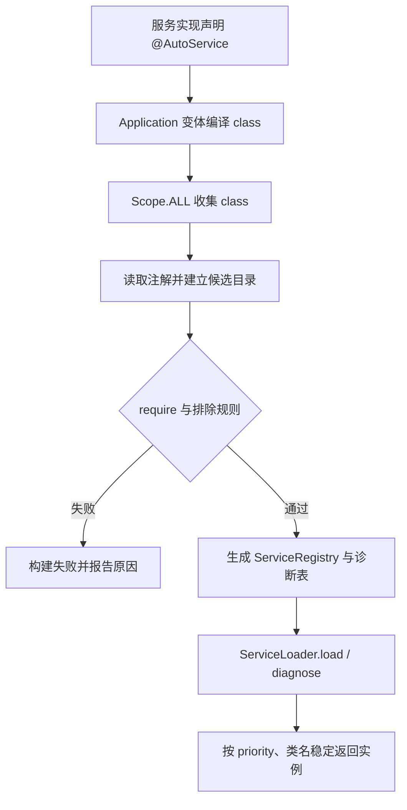

# auto-service-android 0.0.13 接入指南

本文面向外部 Android Application、业务 Library 和服务提供方。完成本文后，Application 可以在编译期发现全量服务实现并生成显式注册表；运行时通过 ServiceLoader 读取注册表，不扫描 classpath，也不依赖反射搜索实现。

## 1. 接入前提

| 项目 | 当前版本要求 |
| --- | --- |
| 版本 | 0.0.13 |
| 最低 Android API | 17 |
| Android Gradle Plugin | 8.13.0 |
| Gradle | 8.13 |
| 构建 JDK | 17 |
| Kotlin Gradle Plugin | 2.1.0 |
| 插件使用位置 | 仅 Application 模块 |
| 发现范围 | Application、项目模块、直接 AAR/JAR、传递 AAR/JAR |

四个坐标必须对齐版本：

```text
com.anymore:auto-service-register:0.0.13
com.anymore:auto-service-loader:0.0.13
com.anymore:auto-service-annotation:0.0.13
com.anymore:auto-service-registry:0.0.13
```

插件坐标由当前模块的 artifactId=auto-service-register 定义。loader POM 会传递 annotation 和 registry；接入方仍建议在版本清单中统一管理四个坐标。

auto-service 的运行时与生成代码不引用 API 24 的 `java.util.function` 或 `Map` 默认方法，因此接入方不需要仅为本框架配置 `coreLibraryDesugaring`。如果业务自己的其他依赖需要 core library desugaring，仍按应用自身需求配置。

## 2. Gradle 配置

### 2.1 根项目声明插件

当前版本采用 buildscript classpath：

```groovy
buildscript {
    repositories {
        google()
        mavenCentral()
        maven {
            url = uri('你的 Maven 仓库地址')
            credentials {
                username = System.getenv('ALIYUN_USERNAME')
                password = System.getenv('ALIYUN_PASSWORD')
            }
        }
    }
    dependencies {
        classpath 'com.anymore:auto-service-register:0.0.13'
    }
}
```

凭据只能通过 CI 密钥、环境变量或用户级 ~/.gradle/gradle.properties 提供，不能写入仓库文件、示例代码或提交历史。普通测试和 assemble 不需要发布凭据。

### 2.2 Application 模块

```groovy
plugins {
    id 'com.android.application'
    id 'org.jetbrains.kotlin.android'
    id 'auto-service'
}

dependencies {
    implementation 'com.anymore:auto-service-loader:0.0.13'
}
```

插件会为每个 Application 变体注册 androidAutoServiceRegister<Variant> 任务，并消费 ScopedArtifacts.Scope.ALL 的 class 输入。不要在 Library 模块应用 auto-service。

### 2.3 Library 或服务提供方模块

```groovy
plugins {
    id 'com.android.library'
}

dependencies {
    // 只声明实现类上的注解时可使用 compileOnly。
    compileOnly 'com.anymore:auto-service-annotation:0.0.13'
}
```

如果 Library 自身也要调用 ServiceLoader：

```groovy
implementation 'com.anymore:auto-service-loader:0.0.13'
```

Library 不生成注册表。最终 Application 通过项目依赖、直接依赖和传递依赖发现其中的实现。发布服务提供方 AAR 时，要把包含实现类的依赖写入 POM 的 api/传递依赖范围；只在提供方本地构建时存在的依赖不会被消费方扫描。

## 3. 声明服务实现

### 3.1 Kotlin

```kotlin
interface StartupTask {
    fun run()
}

@AutoService(StartupTask::class, priority = -10, singleton = true)
class DatabaseStartupTask : StartupTask {
    override fun run() = Unit
}

@AutoService(StartupTask::class, priority = 10, alias = "debug")
class DebugStartupTask : StartupTask {
    override fun run() = Unit
}
```

实现类必须是非抽象类、实现注解中列出的每个服务接口，并提供生成代码可访问的无参构造函数。一个实现可以声明多个接口：

```kotlin
@AutoService(Runnable::class, java.util.concurrent.Callable::class, singleton = true)
class SharedTask : Runnable, java.util.concurrent.Callable<Int> {
    override fun run() = Unit
    override fun call(): Int = 1
}
```

singleton=true 时，多个接口绑定共享同一个惰性线程安全供应器和实例。

### 3.2 Java

```java
@AutoService(
    value = {Runnable.class},
    priority = 10,
    alias = "background",
    singleton = false
)
public final class BackgroundTask implements Runnable {
    @Override public void run() {}
}
```

## 4. 加载服务

```kotlin
val all = ServiceLoader.load<StartupTask>()
all.forEach { it.run() }

val debugOnly = ServiceLoader.load<StartupTask>("debug")
debugOnly.forEach { it.run() }

val first = ServiceLoader.load<StartupTask>().requireFirstPriority()
val last = ServiceLoader.load<StartupTask>().requireLastPriority()
```

Java 调用：

```java
ServiceLoader<Runnable> all = ServiceLoader.load(Runnable.class);
ServiceLoader<Runnable> background = ServiceLoader.load(Runnable.class, "background");
Runnable first = ServiceLoader.load(Runnable.class).requireFirstPriority();
```

加载语义：

- 空 alias "" 返回接口的全部已注册实现；非空 alias 必须精确匹配，区分大小写，不支持正则。
- 返回顺序先按 priority 升序，再按实现类全限定名升序；不要依赖模块或 JAR 顺序。
- firstPriority/lastPriority 在没有实现时返回 null；两个 require*Priority() 在没有实现时抛出异常。
- singleton=false 时，同一个 ServiceLoader 重复遍历复用已创建实例，重新调用 load() 才建立新的实例边界。
- singleton=true 时，跨 load() 调用、跨接口绑定共享实例；只适合承载可跨调用共享的状态。
- ServiceLoader 是惰性加载，创建 loader 不会立即实例化全部服务。

## 5. Debug 诊断

诊断不创建服务实例，只报告构建期候选：

```kotlin
val report = ServiceLoader.diagnose<StartupTask>("debug")

when (report.availability) {
    ServiceDiagnosticAvailability.AVAILABLE -> {
        println("候选=" + report.entries.size)
        println("已注册=" + report.registeredCount)
        println("alias 匹配=" + report.matchingCount)
        println("可用 alias=" + report.availableAliases)
    }
    ServiceDiagnosticAvailability.UNAVAILABLE_IN_NON_DEBUG_BUILD ->
        println("当前变体未携带候选诊断元数据")
    ServiceDiagnosticAvailability.UNAVAILABLE_PLUGIN_NOT_APPLIED ->
        error("Application 模块未应用 auto-service 插件")
}
```

Java 调用：

```java
ServiceDiagnosticReport report = ServiceLoader.diagnose(Runnable.class, "background");
```

ServiceDiagnosticEntry 字段：

| 字段 | 含义 |
| --- | --- |
| implementationClassName | 实现类全限定名 |
| priority | 排序优先级 |
| alias | 声明的精确 alias |
| singleton | 是否共享惰性单例 |
| status | REGISTERED 或 EXCLUDED |
| exclusionRule | 被排除时的命中规则，否则为 null |

ServiceDiagnosticReport 还提供 serviceClassName、requestedAlias、availability、entries、registeredCount、matchingCount 和 availableAliases。

| availability | 触发条件 | entries |
| --- | --- | --- |
| AVAILABLE | debuggable=true 且插件已生成诊断表 | 完整候选，含已注册和排除项 |
| UNAVAILABLE_IN_NON_DEBUG_BUILD | Release 或其他不可调试变体 | 空列表 |
| UNAVAILABLE_PLUGIN_NOT_APPLIED | 仍调用 registry 存根 | 空列表 |

Release 仍可正常 load()；仅诊断元数据被裁剪，不应把 UNAVAILABLE_IN_NON_DEBUG_BUILD 当作服务加载失败。

## 6. Application DSL

```groovy
autoService {
    checkImplementation = true
    sourceCompatibility = '1.8'
    logLevel = 'INFO'

    require('com.example.StartupTask')
    require('com.example.RegionProvider', 'china')

    excludeClassName('com.example.legacy.*')
    excludeAlias('experimental-.*')
    exclude('com.vendor.*', 'fallback')
}
```

| 配置 | 默认值 | 说明 |
| --- | --- | --- |
| checkImplementation | false | true 时执行全部 require 构建期校验 |
| sourceCompatibility | "1.8" | 生成注册表 Java 源码的 source/target |
| logLevel | INFO | VERBOSE、DEBUG、INFO、WARN、ERROR；非法值回退 INFO |
| require(service[, alias]) | 无 | 要求最终扫描结果存在服务；alias 精确匹配 |
| excludeClassName(pattern) | 无 | 按实现类全限定名正则排除 |
| excludeAlias(pattern) | 无 | 按 alias 正则排除 |
| exclude(classPattern, aliasPattern) | 无 | 两个正则同时匹配时排除 |

require() 是构建期校验；requireFirstPriority() 和 requireLastPriority() 是运行时取值，不能互相替代。正则使用 Java String.matches() 的完整字符串匹配语义。

## 7. 完整工作流



建议验证顺序：

1. 执行 ./gradlew :app:assembleDebug，确认 androidAutoServiceRegisterDebug 执行。
2. 在 Debug 调用 ServiceLoader.diagnose<T>()，检查 availability、registeredCount、alias 和排除规则。
3. 调用 ServiceLoader.load<T>() 验证实际实例和顺序。
4. 执行 ./gradlew :app:assembleRelease，确认 Release 仍能加载服务，并接受诊断 entries 为空的预期行为。
5. 运行 JVM/TestKit 与 connected instrumentation 测试。

## 8. 冲突与边界

- 同名普通 class 来自不同目录、AAR 或 JAR 时构建失败，并报告两个真实输入来源；不能依赖 classpath 顺序覆盖。
- 同一个物理输入被重复列出不会误报；两个不同物理输入即使 basename 相同也不会被合并。
- ServiceRegistry 和 ServiceRegistryDiagnostics 是插件替换的保留类，业务代码不要直接调用。
- 插件只应用于 Android Application；普通 Java/Kotlin 模块和 Android Library 只提供实现。
- 实现类必须可被生成注册表直接 new；不满足无参构造、可见性或接口实现约束时，错误会在生成源码编译阶段出现。
- 不要把 Debug 诊断报告原样上报到不受信任的日志系统，其中可能包含实现类名和排除正则。

## 9. 接入完成判定

外部项目达到以下条件即可视为完成接入：

- 四个组件版本统一为 0.0.13；
- 只有 Application 应用了 auto-service；
- 服务实现所在模块被最终 Application 变体依赖；
- Debug diagnose() 返回 AVAILABLE，entries 与预期一致；
- load() 的数量、alias、顺序和实例生命周期符合业务预期；
- Debug、Release assemble 均通过；
- 发布前已完成私服凭据轮换/吊销检查，仓库中没有凭据。

遇到空结果、alias、重复类、Release 诊断或发布问题，请查阅[故障排查](troubleshooting.md)；API 字段和签名请查阅[API 参考](api-reference.md)。
