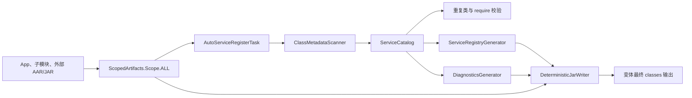

# Auto Service v0.0.13 全依赖发现与诊断设计

## 背景

`auto-service-android` 通过 Gradle 插件扫描 `@AutoService` 实现，并在应用变体中生成 `ServiceRegistry`。当前实现只转换 `ScopedArtifacts.Scope.PROJECT`，因此只能可靠发现应用模块自身的 class，无法兑现“发现所有模块以及外部 AAR/JAR 中实现”的使用契约。

当前诊断能力也主要停留在构建失败信息：当服务为空、别名不匹配、实现被排除或插件没有正确生效时，开发者缺少结构化的定位信息。与此同时，扫描器会将输入构造成完整 `CtClass`，全作用域扫描后可能放大时间和内存开销。

v0.0.13 将先解决正确性、诊断能力、构建可复现性和凭据治理。ASM 迁移安排在 v0.0.14，避免把正确性修复与扫描器重写绑定在同一个版本中。

## 目标

- 在 Application 变体中发现当前应用、所有子模块、直接依赖和传递依赖 AAR/JAR 中的 `@AutoService` 实现。
- 保持 `ServiceLoader.load()`、priority、alias、singleton、require 和排除规则的现有语义。
- 对重复类、缺失实现、排除规则和别名不匹配提供确定、可行动的错误信息。
- 在可调试变体中提供结构化运行时诊断，在不可调试变体中不携带候选实现元数据。
- 让转换任务支持 Gradle Build Cache，并产生顺序与字节内容稳定的输出。
- 让普通源码构建和测试不依赖私有 Maven 凭据。
- 固定支持基线为 AGP 8.13、Gradle 8.13、JDK 17。

## 非目标

- v0.0.13 不把 Javassist 替换为 ASM。
- 不支持 AGP 7.4 或其他历史 AGP 版本。
- 不在 Android Library 模块中应用插件；库模块只提供被应用聚合的服务实现。
- 不新增服务发现白名单、扫描范围或诊断开关等 Gradle DSL。
- 不在 v0.0.13 修改 `@AutoService` 的 `RUNTIME` 保留策略。
- 不自动重写 Git 历史以清除旧凭据。

## 固定约束

- Android Gradle Plugin：8.13.0。
- Gradle Wrapper：8.13。
- 构建 JDK：17。
- 插件只应用于 `com.android.application` 模块。
- 完整运行时诊断由变体的 `debuggable` 属性决定，不通过变体名称推断。
- 生成注册表的默认 source/target compatibility 从 Java 7 提升为 Java 8，仍允许通过现有 DSL 覆盖。
- 所有服务排序必须可复现：priority 升序，同 priority 按实现类全限定名升序。
- 普通重复类不得静默覆盖或采用先到先得策略。

## 方案选择

### 采用：Scoped Artifacts 全作用域转换

插件使用：

```groovy
variant.artifacts
    .forScope(ScopedArtifacts.Scope.ALL)
    .use(taskProvider)
    .toTransform(
        ScopedArtifact.CLASSES,
        /* input jars */,
        /* input directories */,
        /* output jar */
    )
```

`Scope.ALL` 由 AGP 负责提供当前项目、导入项目和全部外部依赖的 class 集合，包括传递依赖。转换任务扫描同一份最终类输入，生成注册表，再将原 class 与生成 class 合并到输出 jar。

### 未采用：手动解析变体依赖

直接解析 Gradle Configuration、手动解包 AAR 并选择变体，需要自行重建 AGP 已提供的属性匹配、传递依赖和 AAR 处理逻辑，维护风险过高。

### 延后：先迁移 ASM 再扩大扫描范围

ASM 能降低扫描开销，但会将正确性修复与扫描器重写耦合。v0.0.13 先建立稳定的扫描结果模型，v0.0.14 只替换扫描实现。

## 总体架构



职责边界：

- `AutoServiceRegisterPlugin`：注册扩展和变体任务，只负责 AGP 接入。
- `AutoServiceRegisterTask`：声明 Gradle 输入输出，协调扫描、校验、生成和合并。
- `ClassMetadataScanner`：从目录和 jar 读取 class 元数据，不负责业务过滤或代码生成。
- `ServiceCatalog`：保存候选实现、注册状态、排除原因、来源和统计信息。
- `ServiceRegistryGenerator`：根据已注册条目生成运行时查表代码。
- `DiagnosticsGenerator`：根据变体类型生成完整诊断表或不可用存根。
- `DeterministicJarWriter`：处理保留类、冲突检查、稳定排序和固定时间戳。

扫描器、目录模型和生成器之间通过明确的数据对象通信。v0.0.14 的 ASM 扫描器必须实现同一输出契约。

## 服务目录数据模型

每个扫描到的普通 class 至少记录：

```text
ClassOrigin
  className: String
  containerName: String
  entryName: String
  contentHash: String
```

运行时诊断不包含绝对磁盘路径。构建错误可以在日志中附加本机物理路径，但不得把该路径写入生成 class。

每个 `@AutoService` 接口绑定记录：

```text
ServiceCandidate
  serviceClassName: String
  implementationClassName: String
  priority: Int
  alias: String
  singleton: Boolean
  origin: ClassOrigin
  status: REGISTERED | EXCLUDED
  exclusionRule: String?
```

一个实现标注多个接口时产生多个绑定记录，但实现类扫描统计只计算一次。排除规则在实现维度判断，并把匹配规则同步到该实现的全部接口绑定。

`ServiceCatalog` 提供以下只读查询：

- 按接口取得全部候选项；
- 按接口取得最终注册项；
- 按接口和 alias 取得最终匹配项；
- 取得排除项及规则；
- 取得扫描、候选、注册、接口和排除统计。

## 全作用域扫描

### 输入处理

- 目录与 jar 按规范化名称排序后扫描。
- jar entry 按 entry name 排序后扫描。
- 仅处理 `.class` 条目。
- 跳过目录项、`module-info.class` 和不代表可实例化类型的元数据条目。
- 使用 Javassist `ClassFile` 直接读取注解属性，不为全部输入创建完整 `CtClass`。
- 同时读取 runtime-visible 和 runtime-invisible annotation，给未来改为 `BINARY` 保留策略留下兼容能力。
- 注解未显式写出的 priority、alias 和 singleton 使用当前默认值 `0`、空字符串和 `false`。

### AAR 与传递依赖

任务不直接解析 `.aar`。AGP 将当前变体要参与 class 处理的 AAR/JAR 内容通过 `ScopedArtifact.CLASSES + Scope.ALL` 暴露为输入 jar 和目录。直接 AAR、传递 AAR、Android Library 子模块和 Java/Kotlin 模块统一走相同扫描路径。

### 重复类策略

Gradle 对同一依赖组件的重复引用通常会在依赖解析阶段去重。若转换输入中仍有两个不同来源提供相同普通类名，任务必须失败。

错误至少包含：

```text
Duplicate class com.example.SharedTask found in auto-service inputs:
  - first-lib-1.0.aar!/classes.jar!/com/example/SharedTask.class
  - second-lib-2.0.jar!/com/example/SharedTask.class
Resolve the dependency conflict; auto-service does not choose one definition.
```

内容摘要相同也不改变失败策略，因为最终 Android 构建仍存在重复定义。摘要只用于诊断和测试。

## 保留生成类策略

以下类名由框架拥有：

- `com.anymore.auto.ServiceRegistry`
- `com.anymore.auto.ServiceRegistryDiagnostics`
- `ServiceRegistryDiagnostics` 的生成内部类。

普通输入中的这些存根不得复制到最终输出。转换任务先过滤保留生成类，再加入当前变体生成的版本。

其他任何普通重复类都按重复类策略失败。保留规则不能扩展为通用覆盖机制。

`ServiceRegistry` 在所有变体中生成。`ServiceRegistryDiagnostics` 根据变体能力生成完整版本或保留不可用存根。

## 运行时模块关系

`auto-service-registry` 从单纯的编译期占位模块调整为稳定运行时契约模块，包含：

- `ServiceRegistry` 存根；
- `ServiceRegistryDiagnostics` 存根；
- `ServiceDiagnosticReport`；
- `ServiceDiagnosticEntry`；
- `ServiceDiagnosticStatus`；
- `ServiceDiagnosticAvailability`。

`auto-service-loader` 使用 `api project(":auto-service-registry")`。registry 模块不再反向依赖 loader，因此不存在模块循环。

不应用新版插件时，存根行为为：

- `ServiceRegistry.get()` 继续明确失败，提示必须应用 auto-service 插件；
- `ServiceRegistryDiagnostics.get()` 返回诊断不可用报告，不抛出类缺失错误。

应用新版插件后，这两个存根由变体生成类替换。

## 运行时诊断 API

新增 API：

```kotlin
ServiceLoader.diagnose(Runnable::class.java)
ServiceLoader.diagnose(Runnable::class.java, "production")
ServiceLoader.diagnose<Runnable>()
ServiceLoader.diagnose<Runnable>("production")
```

返回 `ServiceDiagnosticReport`。报告字段至少包括：

- `serviceClassName`；
- `requestedAlias`；
- `availability`；
- `entries`；
- `registeredCount`；
- `matchingCount`；
- `availableAliases`。

`ServiceDiagnosticEntry` 至少包括：

- 实现类名；
- priority；
- alias；
- singleton；
- `REGISTERED` 或 `EXCLUDED`；
- 可空排除规则描述。

报告提供稳定的 `toString()`，适合直接写入日志。业务判断应使用结构化字段，不要求消费者解析字符串。

## Debug 与 Release 策略

是否携带完整诊断数据由变体 `debuggable` 属性决定。

### `debuggable=true`

- 生成完整 `ServiceRegistryDiagnostics`；
- 保存注册项、排除项、priority、alias、singleton 和排除规则；
- `ServiceLoader.diagnose()` 返回完整结构化报告；
- 生成数据不保存物理绝对路径。

### `debuggable=false`

- 不把候选实现和排除规则写入产物；
- 保留最小 `ServiceRegistryDiagnostics` 实现；
- `diagnose()` 返回 `UNAVAILABLE_IN_NON_DEBUG_BUILD`；
- `ServiceRegistry` 和正常服务加载完全可用。

构建期扫描摘要、重复类错误和 `require()` 诊断在所有变体中都启用，因为这些信息不进入 APK/AAB。

## `require()` 诊断

校验针对排除规则处理后的注册项执行，同时用完整候选目录生成错误上下文。

### 没有候选实现

```text
Missing required service: com.example.StartupTask
No @AutoService implementation was found in this variant's full class scope.
Check the annotation, dependency inclusion, and whether the plugin is applied to the application module.
```

### 候选实现全部被排除

```text
Missing required service: com.example.StartupTask
2 implementations were found, but all were excluded:
  - com.example.LegacyTask, excluded by className /.*Legacy.*/
  - com.example.DebugTask, excluded by alias /debug/
```

### alias 不匹配

```text
Missing required service: com.example.StartupTask (alias="production")
2 registered implementations were found, but none match the requested alias:
  - com.example.DevTask (alias="dev", priority=0)
  - com.example.StagingTask (alias="staging", priority=5)
Available aliases: ["dev", "staging"]
```

接口、require 规则、候选项和 alias 使用稳定顺序输出。扩展内部将 `HashSet` 改为 `LinkedHashSet`，避免错误文本随运行变化。

## 构建日志

INFO 在成功生成后输出一行摘要：

```text
[auto-service] debug: scanned 1247 unique classes, found 10 candidates, registered 8 bindings across 3 interfaces, excluded 2, 286 ms.
```

没有注册项时输出可行动提示。DEBUG 才逐条输出候选来源、排除规则和生成文件位置。

日志中的数量定义固定：

- `unique classes`：去除 AGP 已解析重复输入后的 class 名数量；
- `candidates`：包含 `@AutoService` 的唯一实现类数量；
- `bindings`：接口与实现的注册关系数量；
- `interfaces`：至少有一个注册绑定的接口数量；
- `excluded`：被排除的唯一实现类数量。

## 可缓存和可复现构建

`AutoServiceRegisterTask` 标注 `@CacheableTask`。任务输入包括：

- 全作用域 input jars 和 directories；
- 生成代码编译所需 classpath；
- source compatibility；
- require 规则；
- 排除规则；
- 是否生成完整诊断数据。

确定性要求：

- 所有输入、class、接口、候选项和输出 entry 使用稳定排序；
- 输出 jar entry 使用固定时间戳；
- 生成代码不包含当前时间、绝对路径或随机值；
- service map、alias 集合和诊断列表使用有序集合；
- 相同输入与配置产生相同输出 SHA-256。

首期不并行扫描。只有基准测试证明扫描是主要瓶颈且并行具有稳定收益后，才在后续版本引入并发。

## AGP 接入

插件直接针对 AGP 8.13 的类型 API 编译，不再通过反射查找 `toTransform`、动态加载 `ScopedArtifact.CLASSES` 或构造代理函数。

插件应用到非 Application 模块时给出明确配置错误。库模块无需应用插件，只需正常提供注解实现，由最终 Application 变体聚合。

## 凭据与依赖治理

- 从仓库 `gradle.properties` 删除真实 Maven 用户名和密码。
- 已暴露凭据必须在仓库外完成轮换。
- 普通构建、测试和示例应用使用项目依赖，不访问私有 Maven 仓库。
- `auto-service-loader`、plugin、registry 和 annotation 的内部关系使用 `project(...)`。
- `maven-publish` 发布的 POM 将项目依赖映射为相同版本的外部 Maven 坐标。
- 私有仓库只在凭据存在时配置认证；凭据来自环境变量或用户级 Gradle 属性。
- 缺少凭据时普通构建成功，发布任务在执行前给出明确错误。
- 清理 Git 历史属于独立运维工作，必须另行确认范围和协作方式。

## 测试策略

### 单元测试

- priority 升序和同 priority 类名排序；
- 多接口绑定；
- alias 筛选；
- singleton 供应器共享；
- 三种排除规则；
- 默认注解值；
- runtime-visible 和 runtime-invisible annotation；
- ServiceCatalog 的注册、排除和统计查询；
- Debug 完整报告和 Release unavailable 报告；
- 三种 `require()` 失败文本；
- 重复类来源错误；
- 保留生成类过滤。

### Gradle TestKit 功能测试

测试 fixture 包含：

- Application 模块内实现；
- Android Library 子模块实现；
- Java/Kotlin 子模块实现；
- 发布到测试临时 Maven 仓库的直接外部 AAR；
- 通过另一依赖传入的传递 AAR；
- 两个提供同名 class 的冲突依赖。

每种服务都使用不同 alias 和 priority，以证明来源与排序都正确。测试同时构建 Debug 和 Release。

### 产物与运行时验证

- Debug/Release 最终产物只包含一个 `ServiceRegistry`；
- Debug 包含完整诊断数据；
- Release 的 `ServiceRegistryDiagnostics` 不包含候选列表、alias 和排除规则文本；正常 `ServiceRegistry` 仍会引用已注册实现类；
- Debug 和 Release 都能从所有依赖来源正常加载服务；
- Release `diagnose()` 返回 unavailable；
- 重复类在 auto-service 任务中提前失败并给出两个来源；
- 第二次构建任务为 UP-TO-DATE；
- 启用 Build Cache 后可命中 FROM-CACHE；
- 相同输入的输出 jar SHA-256 相同。

## 发布与迁移

### v0.0.13

- 全作用域服务发现；
- 类型化 AGP 8.13 接入；
- ServiceCatalog；
- 重复类与保留类策略；
- Debug 结构化诊断；
- Release 诊断存根；
- 生成注册表默认使用 Java 8 source/target compatibility；
- `require()` 诊断和扫描摘要；
- 可缓存、可复现任务；
- 凭据和内部依赖治理。

### v0.0.14

- 用 ASM 替换 Javassist 扫描实现；
- 建立小型、中型和大型 class 集基准；
- 根据基准决定是否并行扫描。

### v0.1.0

- 固化诊断数据模型的兼容性承诺；
- 评估并决定是否将 `@AutoService` 改为 `BINARY` 保留策略；
- 发布完整迁移指南和兼容性矩阵。

消费者迁移到 v0.0.13 时必须同时升级 annotation、loader、registry 和 Gradle plugin，避免新旧运行时契约混用。发布说明给出这一约束，并在插件扫描到不兼容 registry API 时提前失败。

## 验收标准

- 示例应用能够加载 Application、子模块、直接 AAR 和传递 AAR 中的实现。
- 服务顺序、alias、singleton、require 和排除规则行为与现有公开语义一致。
- 未显式配置 `sourceCompatibility` 时生成 Java 8 字节码，显式 DSL 覆盖仍然生效。
- Debug 可获取完整结构化诊断，Release 不携带候选诊断元数据。
- 重复普通类不会被静默覆盖。
- 普通构建不需要私有 Maven 凭据。
- Debug、Release、单元测试和 TestKit 功能测试在固定基线上全部通过。
- 转换任务可命中 Build Cache，相同输入产生相同输出哈希。

## 风险与缓解

### 全作用域输入显著增加

缓解：v0.0.13 使用元数据级 ClassFile 读取、稳定缓存和扫描指标；v0.0.14 再迁移 ASM。

### 变体产物中存在预生成 Registry

缓解：保留类使用精确全限定名白名单过滤，普通类不允许覆盖；功能测试验证最终唯一性。

### loader 与 plugin 版本错配

缓解：四个组件统一版本发布，插件验证 registry 运行时契约，并在构建期提供升级提示。

### Release 泄露诊断数据

缓解：以 `debuggable` 属性控制完整诊断生成，Release 产物测试只检查诊断类的常量池与报告内容；正常注册表对实现类的必要引用不视为诊断泄露。

### 凭据已存在于 Git 历史

缓解：先轮换使旧凭据失效；历史清理另行执行，不在普通功能提交中改写共享历史。
